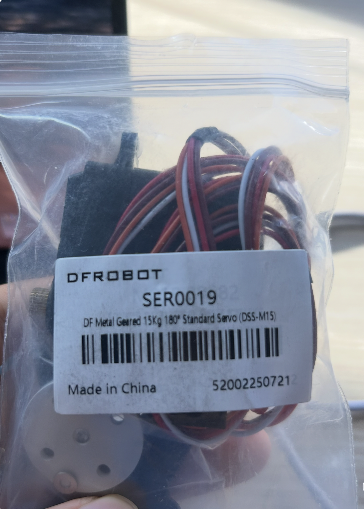
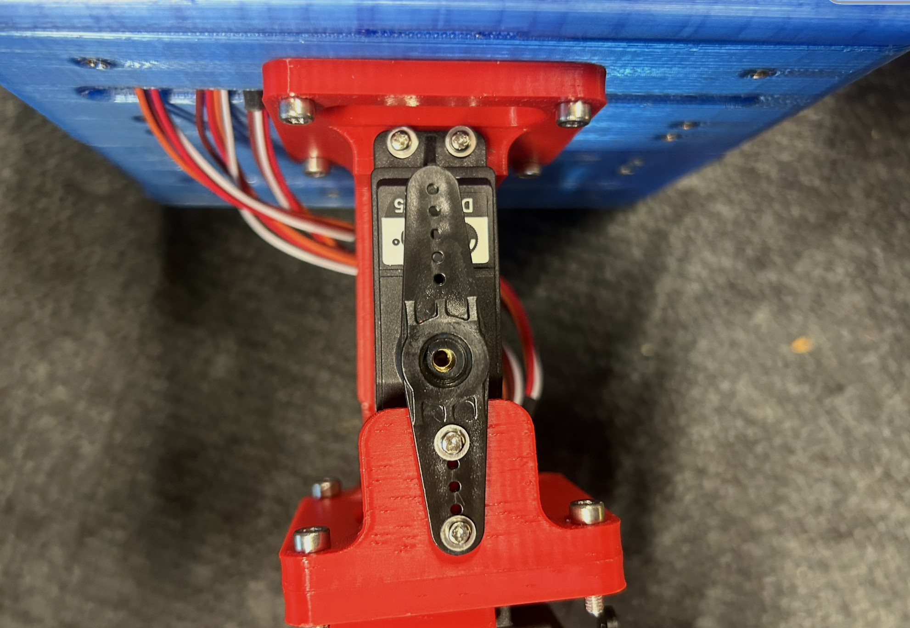
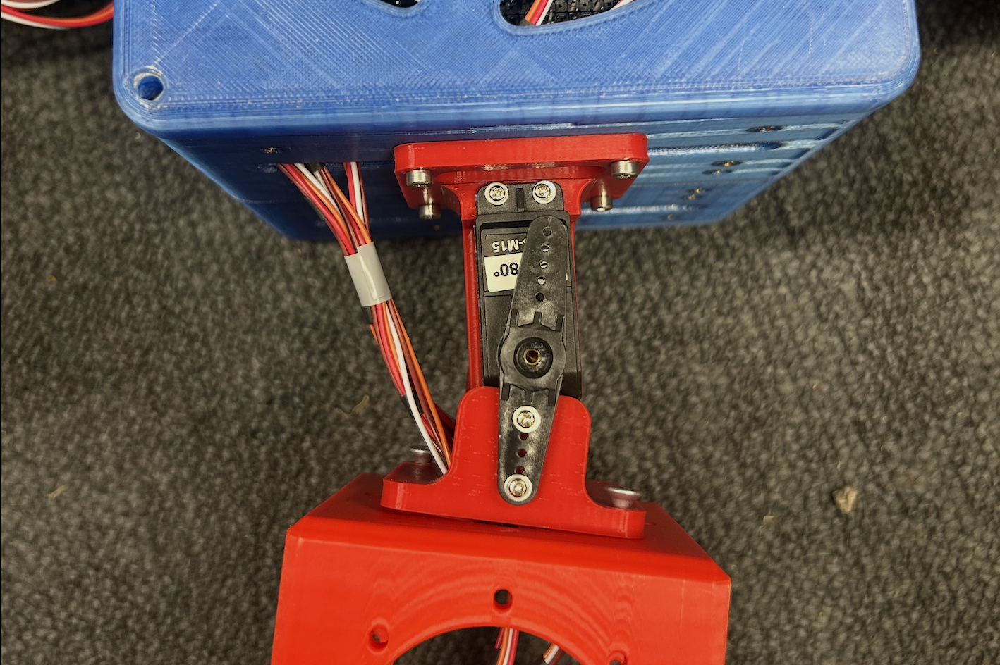
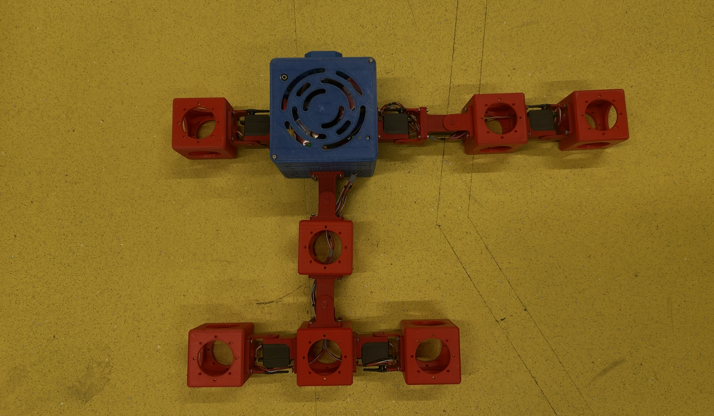
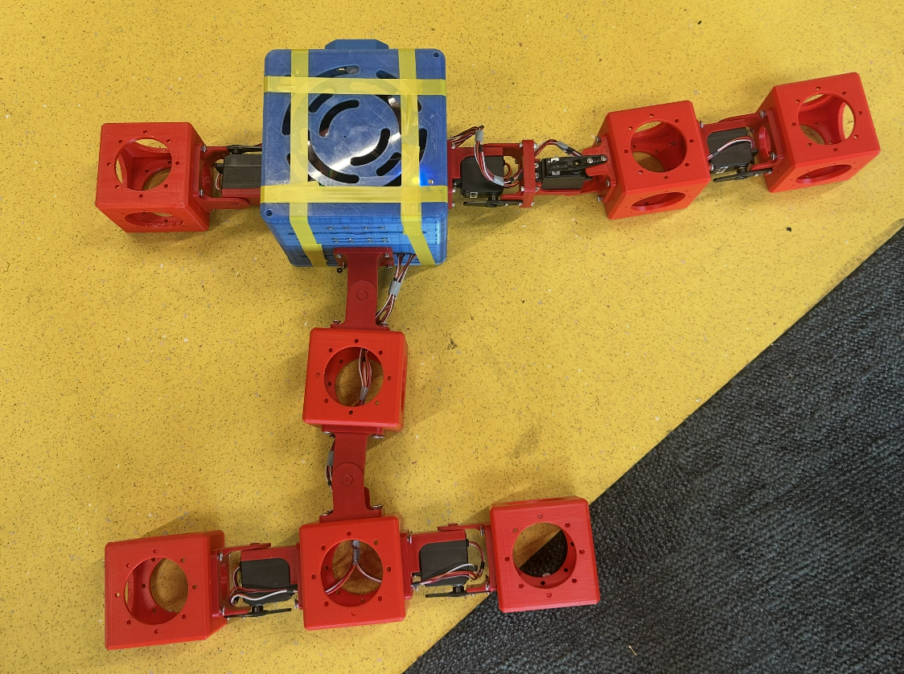
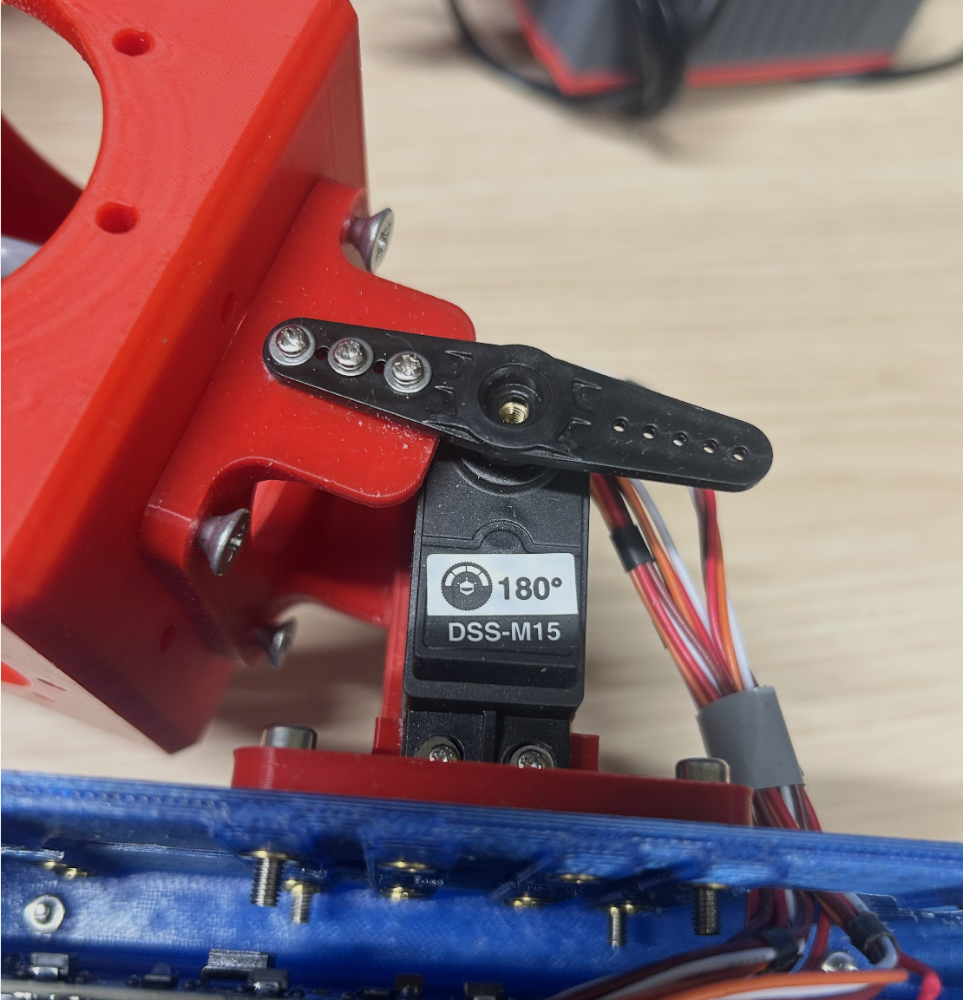

# Notes and Instructions on Hardware Implementation
This document provides a guide for assembling, testing, and running a modular robot. The Python scripts mentioned are all from this repository.

## 1. RPi Setup
These steps are recommended before assembling the robot. They verify that the robot head is working well and prepare for later testing during assembly.
* Starting this step and the following testing steps after the robot is fully assembled is also fine, but making adjustments after full assembly requires disassembling parts back and forth, which wastes time. Repeatedly disassembling and assembling parts might also damage the 3D-printed parts.

Required: a robot head with an microSD card. If possible, choose an SD card with more memory. 32GB is preferred over 8GB.
> Always keep in mind:
> 1. Charge batteries only when you can keep an eye on them.
> 2. Do not leave batteries in the robot. The battery keeps discharging until it starts interfering with the robot and may damage the head. Make sure to remove the batteries.

1. Flash the microSD card with Raspberry Pi OS.
	1. Download Raspberry Pi Imager, a quick tool to install Raspberry Pi OS and other operating systems to a microSD card.
		1. Device: `Raspberry Pi 4`
		2. OS: `Raspberry Pi OS (64-bit)`
		3. Set hostname
		4. Set username and password
			* The hostname, username, and password will be used regularly, so keep them as short as possible. For example, set all of them to `pi`.
		5. Keyboard layout: *us* (it can always be changed using the `raspi-config` tool on the RPi)
		6. Wi-Fi: connect to **Thymionet**
		7. Enable SSH, use password authentication
		8. Enable Raspberry Pi Connect.
2. Prepare SSH:
	1. Connect the RPi and your own laptop to **Thymionet**
	2. Open the terminal (`ctrl+alt+t`) and find the IP address with `ipconfig`.
	3. SSH into it from the terminal: `ssh <username>@<ip address>`
3. Install necessary packages: 
	1. Install Python.
		* It might be helpful to use a lightweight package management tool such as `uv` or `pyenv`.
	2. Install NumPy and OpenCV: `pip install numpy opencv-python`
	3. If required, install CPU-only Torch: `uv pip install torch --index-url https://download.pytorch.org/whl/cpu`
	4. If the robot has a camera, verify the [[picamera2]] installation ([documentation](https://pip-assets.raspberrypi.com/categories/652-raspberry-pi-camera-module-2/documents/RP-008156-DS-2-picamera2-manual.pdf)) on the RPi:
		1. Check with `sudo apt install -y python3-picamera2`
		2. To update *picamera2*, use `sudo apt update` followed by `sudo apt full-upgrade`
4. Install CI Group's *robot-hat* library ([git repo](https://github.com/sunfounder/robot-hat)) on the RPi:
	1. Download the repo: `sudo apt install -y git`, `cd ~`, `git clone git@github.com:ci-group/robohat.git`
	2. Update packages and fix the GPIO dependency: 
		1. ```bash
		   sudo apt update
		   sudo apt upgrade -y
		   sudo apt remove -y python3-rpi.gpio
		   sudo apt install -y python3-rpi-lgpio i2c-tools
		   ```
	3. Then run: `sudo cp /boot/firmware/config.txt /boot/firmware/config.txt.backup`, `sudo cp ~/robohat/setup_files/config.txt /boot/firmware/config.txt`, then `sudo reboot`
	4. Put the files where the library expects them:
		   ```bash
		   mkdir -p ~/bin ~/robohat
			cp ~/robohat/bin/robo ~/robohat/bin/servo ~/robohat/bin/buzz_random ~/bin/
			cp -r ~/robohat/robohatlib ~/robohat/
			cp -r ~/robohat/testlib   ~/robohat/
			cp ~/robohat/Test.py ~/robohat_repo/SerTest.py ~/robohat/
		   ```

## 2. Recommended Assembly Sequence 
The following steps aim to assemble a robot that is as close as possible to the robot's rest posture (i.e. the joint positions before the robot starts moving) in the simulator.

Building blocks required: a head, servo motors, brick modules, and hinge parts.
1. Before starting assembly, **connect only one servo** to the servo board in the head, then run `test_servos_sequential.py` to verify whether the general setup is correct (or use the alternative tests described below). The desired effect is a sweep from $0 \degree$ to $180 \degree$.
	* ARIEL's default hinges are $180 \degree$ DSS-M15 hinges. Avoid using the $270 \degree$ hinges, which might cause problems.
	* The servo type that I used for a successful demo is DSS-M15 with a specific wire color.
	Other servo types might also work, but they might require different test-script settings. 
	* An alternative is to run the `robohat` library's built-in `robo` and `servo` tests to achieve similar effects.
2. **Connect the required number of servos** to the servo boards inside the head. Then run `test_servos_sequential.py` again to test whether all servos are functioning well.
	* If a servo is weak (i.e. it can sweep only over a range much smaller than $[0 \degree, 180 \degree]$) or does not work at all, replace it.
	* If the servo cannot be detected by the `robohat` program or the test script, first try plugging the cable in the other way around, then try another port. From experience, there are two types of servos in the lab, and they require different connection directions.
3. **Assemble and connect the hinges**: assemble and connect the hinges to the servo boards. Follow these sub-steps and principles:
	1. Decide which side of the head will be the front side of the robot. It is better to leave a tape mark. The side with the servo board should be the upper side of the robot head.
	2. Assemble the hinge units with **a test of the servos' neutral positions**:
		1. Loosely assemble the hinges (i.e. assemble the hinge parts and the servo together), but do not screw them on yet. Connect these hinges to the servo boards.
			* **A principle for connecting servos**: connect the servos to *different* servo boards (the two chips inside the head) to avoid possible power or current-load problems.
				* For example, put the forelimb/left-front group on board 1 and the spine/hind group on board 2.
				* If the servos are all connected to one assembly board, it might be overloaded during runtime and might not deliver the requested simultaneous motion cleanly.
		2. Run the built-in `servo` test in the `robohat` library, then enter 5 to move all servos to their neutral position (i.e. the 90-degree position in their 0-180 degree range).
			* Avoid rotating the hinge unit by hand when a program is running.
		3. Check whether the natural position of the servo makes the hinge unit stay relatively neutral (i.e. looks straight). If not, either adjust the hinge parts or plug the servo into another port. From experience, the actual neutral position of each servo changes when you plug it into another port.
			* For example, the first image is more neutral and thus preferable to the second image (ignore the screws). If a hinge appears like the second image, either adjust the hinge parts or plug it into another port. A hinge may not be perfectly neutral, but the goal is to make each hinge as neutral as possible. Step 5 will adjust them further. 
			* The aim of this step is to make the robot's rest posture as close as possible to the rest posture in the simulator. For example, the first rest posture is preferable to the second one. 
		4. Use screws to fully fix each hinge while keeping servo test 5 running. Mark each servo with the board port it is expected to connect to, for example by putting paper tape or a paper tag on the wire or servo body with "left/right board, port 0". Then unplug those wires.
			* This is necessary because the natural position might change when the wire is plugged into another port. If that happens, this step and step 5 must be redone for this hinge.
4. **Fully assemble the robot**: align it carefully with the robot in the simulator, paying particular attention to the hinge directions.
	* At this stage, it might be helpful to visualize the robot in the simulator. Customizing and running `helper/visualizer_sim/visualize_robot.py` in Ariel can help with this work.
	* **A principle for hinge direction**: To align the actual robot with ARIEL's prebuilt or customized robot in `src/ariel/body_phenotypes/robogen_lite/prebuilt_robots/robot_builder.html`, the hinges should always follow a specific convention. The stators (the parts that fix the servo) should always connect to the previous parts relative to the head, and the motor (the part lifted by the motor) should always connect to the next parts. In practice, this means that the servo wires always point out of the head.
		* For reference, the image below shows one hinge. The bottom part is the stator, which connects to the head,and the upper-left part is the motor, which connects to the next brick module. Note that the screw placement in this image is not the standard setting. 
		* The following images show a robot in simulation and in the real world. The darker parts in the simulation are motors, which should correspond to the "wrapping" parts in the real-world robot.  
			* In this assembly, the up-down moving hinges in the forelimbs place the small black connectors at the front, while the hind limbs use the opposite orientation. This is a deliberate choice. If the hind limbs were placed the other way around and moved aggressively, the end brick modules might collide with the forelimbs, and the wires and extended parts of the black connector might pull against each other. This orientation is used for safety. This practice is also suggested.
5. **Determine manually the neutral position**: 
	> Despite the efforts in step 3, the hinges might still be slightly off from the neutral position (i.e. not perfectly "straight"). A mitigation strategy is to let the robot start from the designated neutral position instead of the default natural neutral position (namely, $90 \degree$). The actual command is therefore 90 plus the raw commanded degrees from the robot controller, clamped into $[0 \degree, 180 \degree]$. The code implementation is in `hardware/baby_hardware.py`.
	1. Run the `robo` command, then run `set servo angle <servo nr> <angle>` repeatedly for every servo to find an angle that makes the servo move to the visually neutral position.
		* For example: `set servo angle 0 85`, `set servo angle 0 95`.
		* The two servo boards' port numbers start from 0 to 31, as labeled on the chip. To determine the servo numbers, either try them manually or run `test_servos_sequential.py`.
	2. Edit `hardware/baby_hardware.py` in `DEFAULT_SERVO_MAPPINGS -> neutral_deg`.
		* It will also be helpful to modify the third column of `DEFAULT_SERVO_MAPPINGS` to map the simulated robot channel in the second column to the servo channel of the real robot.
6. **Determine the signs**: 
	> Depending on the actual hinge direction, the output movement of the servos might be the opposite of the movement in the simulated robot. For example, in the simulator, a joint might be commanded to move up, but in the real robot, that joint moves down. For those joints, we add a negative sign to the commanded angle. The code implementation is in `hardware/baby_hardware.py`.
	1. Run `helper/calibration/record_hinge_sweep.py` to record a video that lets each joint sweep over its minimum to maximum allowed angles (in the Mujoco simulator, that means from -90 rad to +90 rad).
	2. Run `test_servos_sequential.py` to observe the actual sweeping of each joint. Record the joint number that differs from the simulator. Then edit `DEFAULT_SERVO_MAPPINGS` in `hardware/baby_hardware.py` -> `sign`.

## 3. Runtime Operations
* **How to turn on the robot**: hold the small yellow button until the red light starts flickering constantly, then immediately release it. Repeat if it does not work.
* **How to shut down the robot**: `sudo shutdown now`
* To transfer files between the RPi and the local device, there are two possible ways:
	1. Via SSH: the safer way
	2. Via Git: more convenient, but the repo might be corrupted if the robot shuts down while files are being transferred, which is a bit tricky to fix.
* If you want to transfer files via Git, the following initialization steps should help:
	1. Clone the project's git repo via SSH. If an SSH certificate issue occurs during `git clone`, try the following debug steps:
		 1. Date and time:
			 1. Check if the time and date are wrong: `date`
			 2. Trigger a time sync: `sudo timedatectl set-ntp true`
		 2. Alternatively: `sudo apt install -y htpdate fake-hwclock`, `sudo htpdate -s www.google.com`
		 3. Update certificate: `sudo apt update` and `sudo apt install --only-upgrade ca-certificates`
		 4. Authenticate the Pi with GitHub:
			 1. Generate an SSH key on your Raspberry Pi: `ssh-keygen -t ed25519 -C "<git username>"`
			 2. Copy the SSH key: `cat ~/.ssh/id_ed25519.pub`
		 5. Add the key to your GitHub account
			1. Go to GitHub and log in.
			2. In the top-right corner, click your profile picture and go to Settings.
			3. In the left sidebar, click SSH and GPG keys.
			4. Click the green New SSH key button.
			5. Give it a Title (e.g., "Raspberry Pi").
			6. Paste your copied key into the Key field.
			7. Click Add SSH key.
		6. Clone the private repo via SSH. To avoid future memory issues, do not download Ariel on the Pi or run `uv sync`.
	2. Allow Git commits and pushes
		1. Set: `git config --global user.email "your_email@example.com"`
		2. And: `git config --global user.name "<username>"`
- **Check remaining storage in the RPi**: `du -h --max-depth=1 ~ 2>/dev/null | sort -h | tail -20`, 
- **Delete a directory**:`rm -r <path>`
- **Copy file from Local to SSH**: ` scp <path to local file> <username>@<ip address>:/home/<username>`
	- A folder: ` scp -r <path to folder> <username>@<ip address>:/home/robohat`
- **Copy file from SSH to local**: `scp PATH <local username>@<local ip address>:<local path>`

## 4. Troubleshooting
1. If the OS can boot successfully from the power cable but not from the battery, check the connection of the yellow cable to both the Power Manager board and the RPi.
2. If the servos can be detected by the `servo` test but cannot be manipulated, try servo numbers 16-31 instead of 0-15.
3. `ssh: connect to host <ip addr> port <nr>: Host is down`, or operation timed out.
	1. Try connect the microSD card to the monitor. If the OS cannot be boosted successfully (e.g. a rainbow-colored window appears and disappears repeatedly), charge the battery and try again.
		1. This may happen because the battery's power supply is not stable or strong enough to supply the RPi. Replacing the battery can help.
4. If the SSH connection is not successful, first check whether the laptop is connected to Thymionet before touching the robot.

## 5. Remaining Issues and Suggestions for Hardware Design
1. Add an extra connection point in the hinge's motor. Two connections are not strong enough for aggressive movement in long arms or legs.
2. Add two more screw holes to the robot's bottom lid. If only two are used, the robot is not stable enough. Adding screws will also lift the robot's head slightly, so the robot's limbs might no longer touch the ground as they do in the simulator. This might add an extra layer of error.
3. Friction is a problem when running the robot. Wrapping the modules with tape might help.
